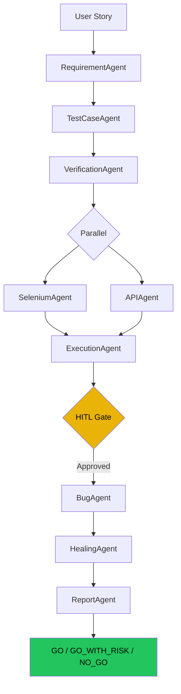

# Agent Pipeline Overview

AI TestPilot X orchestrates **10 specialized AI agents** through a LangGraph stateful graph. Each agent has a single responsibility, typed inputs/outputs, and communicates via `GlobalState`.

## Pipeline flow



## The 10 agents

<div class="tp-pipeline">
  <div class="tp-pipeline__step">
    <div class="tp-pipeline__num">01</div>
    <div>
      <div class="tp-pipeline__name">RequirementAgent</div>
      <div class="tp-pipeline__desc">Parses the user story into structured modules, risk areas, and priority classification using Gemini 2.5 Flash.</div>
    </div>
  </div>
  <div class="tp-pipeline__step">
    <div class="tp-pipeline__num">02</div>
    <div>
      <div class="tp-pipeline__name">TestCaseAgent</div>
      <div class="tp-pipeline__desc">Generates structured test cases (UI, API, edge cases) enriched with RAG context from the knowledge base.</div>
    </div>
  </div>
  <div class="tp-pipeline__step">
    <div class="tp-pipeline__num">03</div>
    <div>
      <div class="tp-pipeline__name">VerificationAgent</div>
      <div class="tp-pipeline__desc">Coverage analysis, duplicate detection, and edge case gap identification. Flags under-tested paths.</div>
    </div>
  </div>
  <div class="tp-pipeline__step">
    <div class="tp-pipeline__num">04</div>
    <div>
      <div class="tp-pipeline__name">SeleniumAgent</div>
      <div class="tp-pipeline__desc">Generates executable Python Selenium scripts with robust locator strategies per test case.</div>
    </div>
  </div>
  <div class="tp-pipeline__step">
    <div class="tp-pipeline__num">05</div>
    <div>
      <div class="tp-pipeline__name">APIAgent</div>
      <div class="tp-pipeline__desc">Generates HTTP test suites (httpx) with auth headers, request bodies, and response assertions.</div>
    </div>
  </div>
  <div class="tp-pipeline__step">
    <div class="tp-pipeline__num">06</div>
    <div>
      <div class="tp-pipeline__name">ExecutionAgent</div>
      <div class="tp-pipeline__desc">Runs tests in MOCK / LOCAL / GRID mode. Manages trust domains and the HITL approval gate.</div>
    </div>
  </div>
  <div class="tp-pipeline__step">
    <div class="tp-pipeline__num">07</div>
    <div>
      <div class="tp-pipeline__name">BugAgent</div>
      <div class="tp-pipeline__desc">Root cause analysis on failures. RAG correlation against historical bugs. Severity classification and clustering.</div>
    </div>
  </div>
  <div class="tp-pipeline__step">
    <div class="tp-pipeline__num">08</div>
    <div>
      <div class="tp-pipeline__name">HealingAgent</div>
      <div class="tp-pipeline__desc">Self-healing locator recovery: 7-level fallback from ID to AI-generated selectors. Patches tests automatically.</div>
    </div>
  </div>
  <div class="tp-pipeline__step">
    <div class="tp-pipeline__num">09</div>
    <div>
      <div class="tp-pipeline__name">ReportAgent</div>
      <div class="tp-pipeline__desc">Synthesizes all results into a GO / GO_WITH_RISK / NO_GO release decision with risk score and recommendations.</div>
    </div>
  </div>
</div>

## Agent details

For deep-dives on each agent:

- [RequirementAgent](requirement-agent.md)
- [TestCaseAgent](testcase-agent.md)
- [VerificationAgent](verification-agent.md)
- [SeleniumAgent](selenium-agent.md)
- [APIAgent](api-agent.md)
- [ExecutionAgent](execution-agent.md)
- [BugAgent](bug-agent.md)
- [HealingAgent](healing-agent.md)
- [ReportAgent](report-agent.md)

## GlobalState

All agents share a single `GlobalState` TypedDict threaded through the LangGraph graph:

```python
class GlobalState(TypedDict):
    session_id: str
    story: str
    target_url: str
    execution_mode: str

    # Agent outputs
    requirements: list[Requirement]
    test_cases: list[TestCase]
    verification: VerificationResult
    selenium_scripts: list[SeleniumScript]
    api_tests: list[APITest]
    execution_results: list[ExecutionResult]
    bugs: list[Bug]
    healed_locators: list[HealedLocator]
    report: ReportOutput

    # Control flow
    hitl_approved: bool
    error: str | None
    checkpoint: str
```
