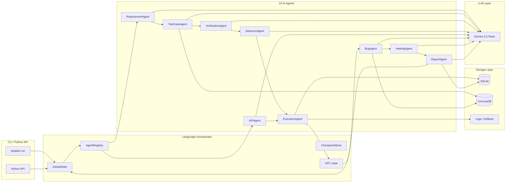

# Architecture

How AI TestPilot X is built — LangGraph orchestration, agent design, storage, and deployment.

## System diagram



## LangGraph orchestration

The pipeline is a **directed acyclic graph** with one conditional branch (HITL gate):

```python
# orchestrator.py
graph = StateGraph(GlobalState)
graph.add_node("requirements", requirement_agent.run)
graph.add_node("testcases",    testcase_agent.run)
graph.add_node("verification", verification_agent.run)
graph.add_node("selenium",     selenium_agent.run)
graph.add_node("api",          api_agent.run)
graph.add_node("execution",    execution_agent.run)
graph.add_node("bugs",         bug_agent.run)
graph.add_node("healing",      healing_agent.run)
graph.add_node("report",       report_agent.run)

graph.add_edge("requirements", "testcases")
graph.add_edge("testcases",    "verification")
graph.add_edge("verification", "selenium")
graph.add_edge("verification", "api")
graph.add_edge(["selenium", "api"], "execution")
graph.add_conditional_edges("execution", hitl_gate, {
    True:  "bugs",
    False: END,   # HITL rejected
})
graph.add_edge("bugs",    "healing")
graph.add_edge("healing", "report")
```

**Checkpointing** — every node's output is persisted to SQLite before the next node runs. A failed pipeline can be resumed from the last checkpoint.

## RAG engine (ChromaDB)

Four collections in ChromaDB, all using `all-MiniLM-L6-v2` embeddings:

| Collection | What's stored | Used by |
|---|---|---|
| `test_cases` | Historical test cases + outcomes | TestCaseAgent (similar tests) |
| `bugs` | Bug reports + root causes + fixes | BugAgent (RAG correlation) |
| `requirements` | Parsed requirement modules | RequirementAgent (context) |
| `knowledge_base` | Ingested docs (PDFs, Markdown) | All agents |

```python
# core/rag_engine.py
from chromadb import EmbeddingFunction
from sentence_transformers import SentenceTransformer

class RAGEngine:
    def query(self, collection: str, query: str, n_results: int = 5):
        ...
    def add(self, collection: str, documents: list[str], metadata: list[dict]):
        ...
```

## Storage

**SQLite** (via SQLAlchemy, 6 tables):

| Table | Contents |
|---|---|
| `requirements` | Parsed requirement modules per session |
| `testcases` | Generated test cases |
| `executions` | Test execution results |
| `bugs` | Bug reports from BugAgent |
| `reports` | Final GO/NO GO reports |
| `trust_domains` | HITL trust domain registry |

SQLAlchemy models are in `storage/models.py`. Swap to PostgreSQL by changing `DB_URL` — no code changes.

## Self-healing locator hierarchy

When a Selenium test fails with a `NoSuchElementException`, `HealingAgent` walks this 7-level fallback:

```
1. ID             (#login-btn)
2. Name           (name="username")
3. data-testid    (data-testid="submit")
4. data-qa        (data-qa="checkout-btn")
5. CSS selector   (.login-form > button[type=submit])
6. XPath          (//button[contains(text(),'Log in')])
7. AI-generated   (Gemini generates a new locator from page DOM snapshot)
```

The healed locator is saved back to the test script and stored in ChromaDB for future sessions.

## Tech stack

| Layer | Technology | Version |
|---|---|---|
| LLM | Google Gemini 2.5 Flash | `google-generativeai >= 0.8` |
| Orchestration | LangGraph | `0.3.*` |
| RAG | ChromaDB + all-MiniLM-L6-v2 | `chromadb >= 0.5` |
| CLI | Typer + Rich | `typer >= 0.12` |
| UI | Streamlit + Plotly + streamlit-agraph | `streamlit >= 1.40` |
| Browser | Selenium 4 + webdriver-manager | `selenium >= 4.0` |
| HTTP tests | httpx | `httpx >= 0.27` |
| Storage | SQLAlchemy + SQLite | `sqlalchemy >= 2.0` |
| Validation | Pydantic v2 | `pydantic >= 2.0` |
| Observability | LangSmith + Loguru | |

## Deployment modes

| Mode | Use case | Notes |
|---|---|---|
| Local dev | Full dev loop with real browser | `EXECUTION_MODE=LOCAL` |
| Streamlit Cloud | Demo, CI preview | `EXECUTION_MODE=MOCK`, no Chrome |
| Docker + Selenium Grid | Parallel real browser CI | `EXECUTION_MODE=GRID` |
